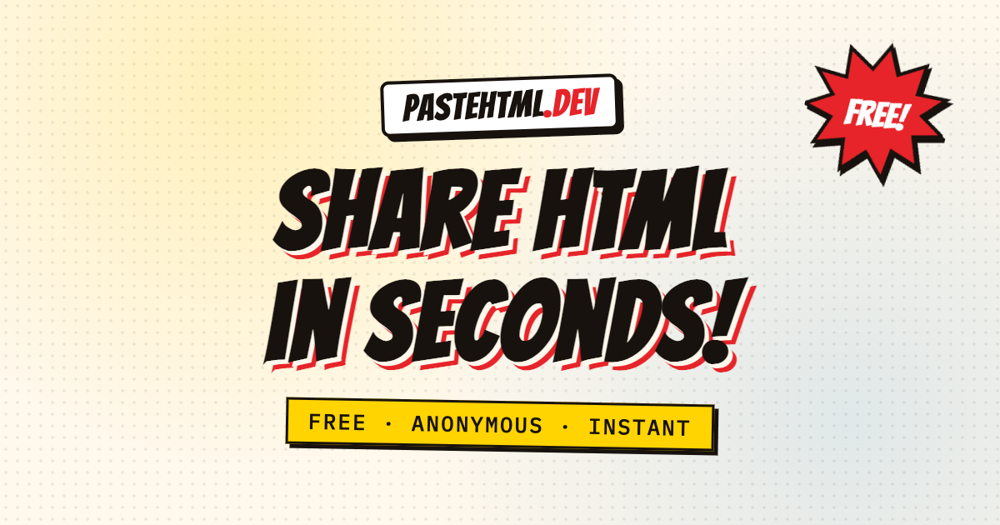

<p align="center">
  <a href="https://pastehtml.dev">
    
  </a>
</p>

# pastehtml.dev

Share HTML pages in seconds. Drop an HTML file, get a private link your friends
can open, preview, and view the source of. No accounts, no editing, no fuss.

## How it works

- Drag and drop (or browse for) an `.html`/`.htm` file up to 2 MB.
- The document is published at `https://<token>.pastehtml.dev/` — its own
  isolated origin — with an inspector page (copy link, preview, highlighted
  source) at `/p/<token>`. Tokens are random 32-character
  lowercase-alphanumeric IDs (~165 bits of entropy — lowercase because they
  double as subdomains, and browsers lowercase hostnames), so links are
  private unless shared.
- Pastes can never be deleted, and only the holder of a paste's secret update
  token (returned once by the API at creation) can change it. The web UI has
  no update or delete routes at all.
- The share page offers a live preview (with an in-site fullscreen mode) and
  a Rouge-highlighted source view.
- Every paste is served as a real page from its own origin —
  `https://<token>.pastehtml.dev/` — so scripts and localStorage work
  (review-progress checklists persist) while staying fully isolated from
  other pastes and from the app itself. The path-based `/p/<token>/raw`
  endpoint additionally serves the source inside a CSP `sandbox`.

## Agent API

Publish without a browser — ideal for AI agents that produce design documents
or implementation plans and want to hand back a share link:

```bash
# Multipart upload
curl -F "file=@plan.html" https://pastehtml.dev/api/pastes

# Or stream the HTML straight from a pipe
curl --data-binary @plan.html -H "Content-Type: text/html" \
  "https://pastehtml.dev/api/pastes?filename=plan.html"
```

Both return `201` with `{ token, title, live_url, url, raw_url, update_token }`
(or `422` with `{ errors }`). The `update_token` is revealed exactly once — the
server stores only a digest — but it stays valid forever and authorizes any
number of in-place updates:

```bash
curl -X PATCH -H "Authorization: Bearer $UPDATE_TOKEN" \
  -F "file=@plan.html" https://pastehtml.dev/api/pastes/$TOKEN
```

Updates accept the same two body forms as creation and return `200` with the
refreshed `{ token, title, live_url, url, raw_url }`, `403` for a wrong or
missing update token, and `404` for an unknown paste. All API endpoints are
rate limited per IP.

Agents discover all of this on their own: the full integration guide lives at
[`/llms.txt`](https://pastehtml.dev/llms.txt) (also pointed to from the
homepage, both visibly and in an HTML comment for raw fetchers). Telling an
agent "publish this on pastehtml.dev" is enough.

## Stack

- Ruby on Rails 8.1 · PostgreSQL · Hotwire (Turbo + Stimulus)
- Tailwind CSS v4 (cssbundling) · esbuild (jsbundling) · Yarn 4
- Tooling via [mise](https://mise.jdx.dev), PostgreSQL via Docker Compose
- Comic-book design: Bangers display type over Inter, halftone textures,
  ink-outlined panels with hard offset shadows
- Installable PWA: manifest + minimal network-first service worker with an
  offline fallback page (pastes themselves are never cached)
- SEO via meta-tags (OG/Twitter cards with a branded OG image, canonical,
  noindex on paste pages) and comic-styled static error pages

## Development

```bash
mise run dev        # starts postgres (docker), installs deps, prepares db, runs bin/dev
```

Or step by step:

```bash
mise run docker:start   # postgres on localhost:5435
mise run deps           # bundle install + yarn install
mise run db:prepare
bin/dev                 # rails server + js/css watchers on port 3000
```

## Tests and lint

```bash
mise run test   # rails test
mise run lint   # rubocop + brakeman
```

## Deployment

Deploys with [Kamal](https://kamal-deploy.org) from GitHub Actions (the
"Kamal Run" workflow) to a single server: the app container plus a postgres
18 accessory. `db/production.sql` creates the Solid Cache/Queue databases on
the accessory's first boot. Pastes are served from `<token>.pastehtml.dev`
subdomains, so the proxy routes the wildcard with a Cloudflare Origin CA
certificate (wildcards can't get Let's Encrypt certs over HTTP-01).

One-time setup:

1. **Cloudflare** (free plan): add a proxied `A` record for `pastehtml.dev`,
   `www`, and a proxied wildcard `*` record, all pointing at the server.
   Set SSL/TLS mode to **Full (strict)**. Create an Origin Server
   certificate for `pastehtml.dev, *.pastehtml.dev` and keep the PEM pair.
2. **Repository Actions secrets**: `SERVER_IP`, `SSH_PRIVATE_KEY` (root
   access to the server), `RAILS_MASTER_KEY` (from `config/master.key`),
   `POSTGRES_PASSWORD`, `CLOUDFLARE_ORIGIN_CERTIFICATE` and
   `CLOUDFLARE_ORIGIN_KEY` (the Origin CA PEM pair). The container registry
   (ghcr.io) authenticates with the workflow's own `GITHUB_TOKEN`.
3. Run the **Kamal Run** workflow with the command `setup` once (provisions
   postgres + proxy), then with `deploy` for every release.

For local runs of kamal commands, put the Origin CA pair in
`.kamal/certs/origin.pem` / `origin-key.pem` (gitignored), export
`SERVER_IP` and `POSTGRES_PASSWORD`, and remove the GHA builder cache block
from `config/deploy.yml` if you need to build the image locally.
